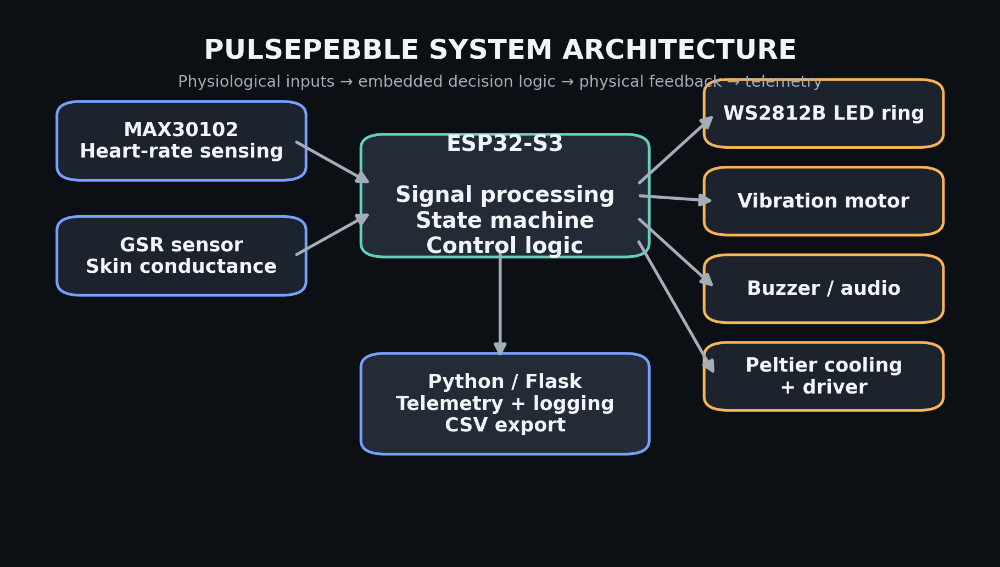
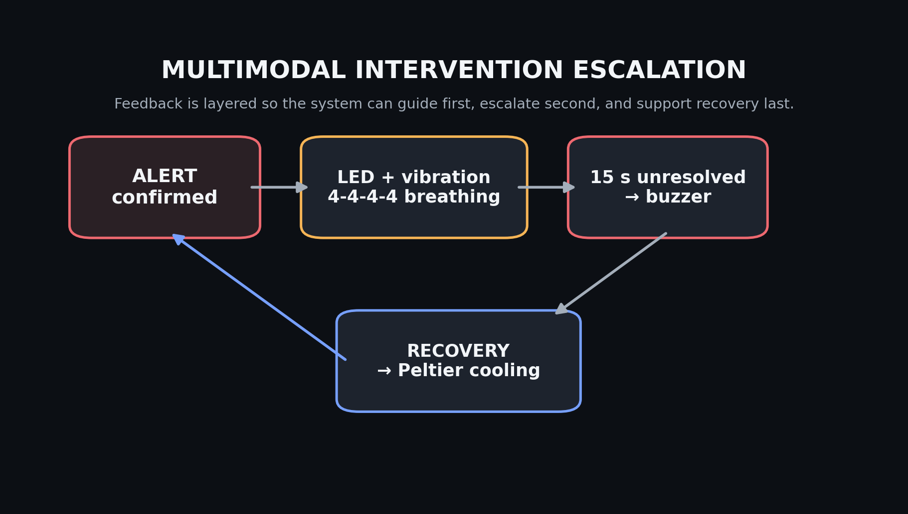
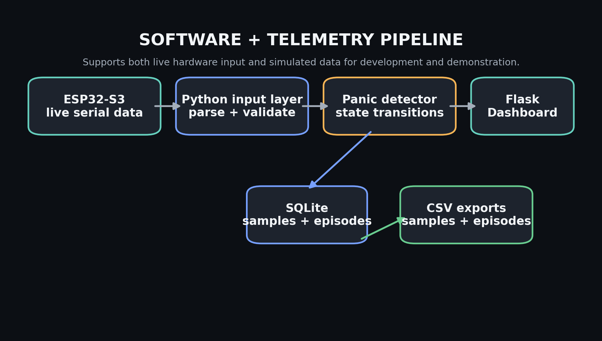

# PulsePebble - Handheld Physiological Monitoring & Guided-Feedback Device
An end-to-end embedded systems prototype combining physiological sensing, real-time state detection, multimodal physical feedback, and software telemetry.

Designed and engineered by **Anushka Misra**  
*Electrical & Computer Engineering, University of Washington 2026*

---

## 📌 Project Overview

PulsePebble is a handheld, self-directed embedded prototype engineered to sense sustained physiological changes and respond using progressive, multimodal feedback. The project validates end-to-end signal processing, finite-state machine (FSM) control logic, actuator integration, and real-time serial telemetry.

- **Primary Controller:** ESP32-S3
- **Sensors:** MAX30102 PPG Heart-Rate Sensor, Galvanic Skin Response (GSR) Sensor
- **Actuators:** WS2812B Addressable LED Ring, Vibration Motor, Audio Buzzer, Peltier Cooling Module + Driver
- **Software Stack:** Embedded C++, Python, Flask, SQLite
- **Mechanical:** Custom Handheld Enclosure with Tactile Surface Ridges (Onshape CAD)

---

## 🛠️ System Architecture

The device evaluates physiological inputs concurrently, processes state logic on the MCU, triggers physical feedback, and streams live telemetry to a host application.



### Core Subsystems:
* **Physiological Sensing:** Dual-signal acquisition combining heart rate (PPG) and skin conductance (GSR).
* **Embedded Processing:** ESP32-S3 handling signal filtering, FSM transitions, debounced user control, and output PWM/GPIO drivers.
* **Multimodal Feedback:** Layered visual, haptic, auditory, and thermal outputs.
* **Telemetry Pipeline:** Python-based parser logging live hardware inputs and episode data to a Flask dashboard and SQLite database.

---

## 🚦 Detection State Machine

To prevent false positives from transient physiological spikes, the system utilizes a dual-signal thresholding approach paired with confirmation and recovery timing windows.

* **NORMAL:** Baseline monitoring of dual physiological parameters.
* **PREALERT:** Initiated upon concurrent signal elevation; enters a confirmation window.
* **ALERT:** Confirmed sustained state; triggers progressive feedback response.
* **RECOVERY:** Triggered when signals return to baseline; shifts to cooling feedback and log generation.

---

## 🔄 Multimodal Feedback Escalation

Feedback modalities are structured to guide user regulation first, escalate second, and support recovery last:



1. **Guided Visual & Haptic Cues:** Synchronized WS2812B LED breathing animations and subtle haptic feedback.
2. **Auditory Escalation:** Secondary audio cue if physiological elevation remains unresolved over a set duration.
3. **Thermal Recovery Support:** Active Peltier cooling engagement during state recovery.

---

## 🖥️ Telemetry & Software Pipeline

The software pipeline provides real-time observability without placing UI processing load on the microcontroller:



* **Serial Data Parsing:** Python backend validates live serial input from the ESP32-S3.
* **Episode Logging:** Captures metrics including pre-alert duration, peak physiological values, alert duration, and recovery timing into SQLite/CSV exports.
* **Flask Dashboard:** Displays real-time trends, active device states, and historical episode archives.

---

## 📐 Mechanical & Enclosure Design

* **Form Factor:** Ergonomic, single-hand grip modeled in Onshape after tactile worry-stones.
* **Tactile Surface:** Incorporates textured ridges on the outer surface to serve as an intentional sensory interaction layer.
* **Ergonomics:** Strategic sensor placement around natural hand placement and palm-facing thermal feedback zones.

---

## 📈 Project Status & Roadmap

- [x] Dual-sensor integration (PPG + GSR)
- [x] ESP32-S3 firmware state machine logic
- [x] Synchronized LED, haptic, audio, and thermal actuator control
- [x] Python / Flask telemetry pipeline and episode logging
- [ ] PCB design & schematic layout consolidation *(V2 In Progress)*
- [ ] 3D-printed enclosure integration with tactile ridges
- [ ] Battery management & power circuit integration (V2)
- [ ] Hardware validation & system testing

---

## 🛠️ Technical Skills Demonstrated

* **Embedded Systems:** Embedded C++, ESP32-S3, FSM Design, Hardware Timers, Interrupts, Debouncing
* **Sensory & Actuation:** PPG (MAX30102), GSR, SPI/I2C/UART Protocols, PWM Driver Control, WS2812B Addressing
* **Software:** Python, Flask, Serial Communication, SQLite, Data Logging
* **Hardware & Mechanical Design:** Breadboard Prototyping, Onshape CAD Modeling, Ergonomic Design

```
